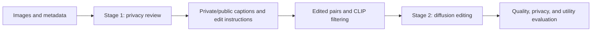

# Unsafe2Safe

[](https://arxiv.org/abs/2603.28605)
[](https://see-ai-lab.github.io/unsafe2safe/)
[](https://huggingface.co/datasets/minhdinh2/Unsafe2Safe)

Unsafe2Safe creates privacy-preserving image edits while preserving the useful visual content of the source image.

This repository contains the project-owned captioning, dataset preparation, editing, training adapters, evaluation helpers, and prompt assets used by the project. Large third-party model repositories, checkpoints, datasets, and generated outputs stay outside the repository.

> [!NOTE]
> This is a practical research release. The public files cover the project-owned pipeline pieces; model-heavy stages still require external checkouts, local datasets, and checkpoints.

## Pipeline at a glance



Stage 2 can use the released project adapters for InstructPix2Pix, OminiControl, and FlowEdit while their upstream model repositories remain external.

## Installation

Create an environment and install the shared Python dependencies:

```bash
python -m venv .venv
source .venv/bin/activate
pip install -r requirements.txt
```

Install a PyTorch build that matches the target CPU or CUDA platform when the default pip resolution is not suitable. Stage 1 also requires the model dependencies for the selected backend. The diffusion entry points require a compatible external diffusion checkout.

## Project layout

```text
prompts/                  Captioning, privacy, and edit-instruction prompts.
vlm_captioning/           Stage 1 generation, parsing, and flag evaluation.
unsafe2safe/dataset_creation/  Metadata and image-pair preparation utilities.
unsafe2safe/metrics/            CLIP, image, privacy, caption, and utility scores.
unsafe2safe/vqa/                Qwen3-VL OK-VQA fine-tuning and prediction scripts.
unsafe2safe/scripts/            Download, training, and batch-inference launchers.
unsafe2safe/                    Editing adapters, datasets, Safe Attention, and demo.
```

The code is released in practical research form. Paths, checkpoints, and model choices are explicit where possible, but the model-heavy stages still require compatible external installations and local data.

## Stage 1: captioning and privacy instructions

The default configuration uses an InternVL backend for image captioning and privacy flags, and a Qwen text backend for edit instructions and caption combination.

Expected local layout:

```text
data/mscoco/                  Source images.
metadata/mscoco.csv           CSV containing a file column.
outputs/mscoco/               Generated JSON files.
```

Generate privacy-aware captions:

```bash
python vlm_captioning/run_stage1.py \
  --config vlm_captioning/configs/stage1.yaml \
  --purpose generate_captions \
  --dataset mscoco
```

Compare original and anonymized images:

```bash
python vlm_captioning/run_stage1.py \
  --config vlm_captioning/configs/eval.yaml \
  --purpose compare_anonymization \
  --dataset mscoco
```

Collect generated captions into one CSV:

```bash
python -m vlm_captioning.collect_captions \
  --captions-dir outputs/mscoco/generate_captions \
  --metadata metadata/mscoco.csv \
  --output metadata/mscoco_with_captions.csv \
  --parse-structured
```

Evaluate privacy flags against VISPR annotations:

```bash
python -m vlm_captioning.evaluate_flags metadata/vispr_predictions.csv data/vispr/annotations
```

The flag-evaluation CSV must contain `file` and `PRIVACY_FLAG` columns. Structured model responses can also be parsed directly:

```python
from vlm_captioning.output_parser import parse_structured_output

parsed = parse_structured_output(model_response)
```

## Dataset preparation

The dataset helpers in `unsafe2safe/dataset_creation/` prepare image and text inputs for the captioning and editing stages. To keep edited pairs semantically aligned, filter CLIP scores with the normalized threshold used by the project:

```bash
python unsafe2safe/dataset_creation/filter_dataset.py \
  scores.csv filtered_scores.csv \
  --threshold 0.7
```

The input score CSV should contain `clip_orig` and `clip_edit` columns. Rows are kept when `clip_edit / clip_orig` is greater than the threshold.

## Editing and training

The original diffusion implementation is not vendored. For the InstructPix2Pix path, use a clean external checkout and keep its checkpoints outside this repository. The project adapter imports the external code and applies the project-specific model changes in memory.

Train with the example configuration:

```bash
./unsafe2safe/scripts/train_unsafe2safe.sh \
  /path/to/instruct-pix2pix \
  unsafe2safe/configs/train_unsafe2safe.yaml \
  /path/to/logs \
  0,1,2,3
```

Run batch editing from the repository root:

```bash
./unsafe2safe/scripts/run_unsafe2safe.sh \
  INPUT_CSV OUTPUT_DIR CHECKPOINT IMAGE_ROOT
```

The batch editor expects the external diffusion checkout at `stable_diffusion/` for its legacy runtime path, together with a compatible config and checkpoint. See `unsafe2safe/README.md` for the external checkout details and data columns used by the training loader.

The project also contains an Unsafe2Safe-specific OminiControl adapter in [`unsafe2safe/ominicontrol/`](unsafe2safe/ominicontrol/README.md). OminiControl and FLUX remain external dependencies; their upstream source is not copied or modified here.

The project also contains a minimal FlowEdit adapter in
[`unsafe2safe/flowedit/`](unsafe2safe/flowedit/README.md). FlowEdit remains an
external MIT-licensed dependency.

See [`THIRD_PARTY.md`](THIRD_PARTY.md) for upstream revisions, installation
boundaries, attribution, and license status.

## Evaluation

The reusable metric helpers in `unsafe2safe/metrics/` cover the project’s current public evaluation surface:

- CLIP and directional CLIP similarity.
- SSIM and LPIPS image similarity.
- Nearest-counterpart FaceSim.
- Token-set TextSim and normalized Race Entropy.
- VLM anonymization score collection.
- BLEU-4 and CIDEr captioning scores.
- Downstream top-1 classification accuracy.

Keep downloaded datasets, checkpoints, generated images, and experiment outputs outside version control. The repository ignores common `outputs/` and `runs/` directories.

## Downstream VQA

The Qwen3-VL OK-VQA training and prediction scripts are under [`unsafe2safe/vqa/`](unsafe2safe/vqa/README.md). They accept dataset roots, safe/private manifests, adapter paths, and output paths as command-line arguments.

## Links

- [Dataset on Hugging Face](https://huggingface.co/datasets/minhdinh2/Unsafe2Safe)
- [Project page](https://see-ai-lab.github.io/unsafe2safe/)
- [Paper](https://arxiv.org/abs/2603.28605)

## Citation

```bibtex
@misc{dinh2026unsafe2safe,
  title={Unsafe2Safe: Controllable Image Anonymization for Downstream Utility},
  author={Mih Dinh and SouYoung Jin},
  year={2026},
  eprint={2603.28605},
  archivePrefix={arXiv},
  primaryClass={cs.CV},
  doi={10.48550/arXiv.2603.28605},
  url={https://arxiv.org/abs/2603.28605}
}
```
